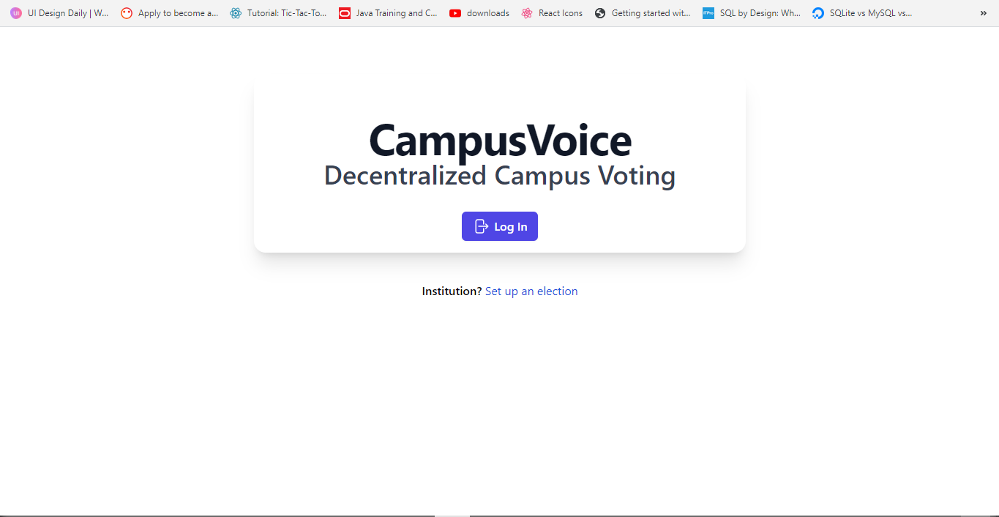
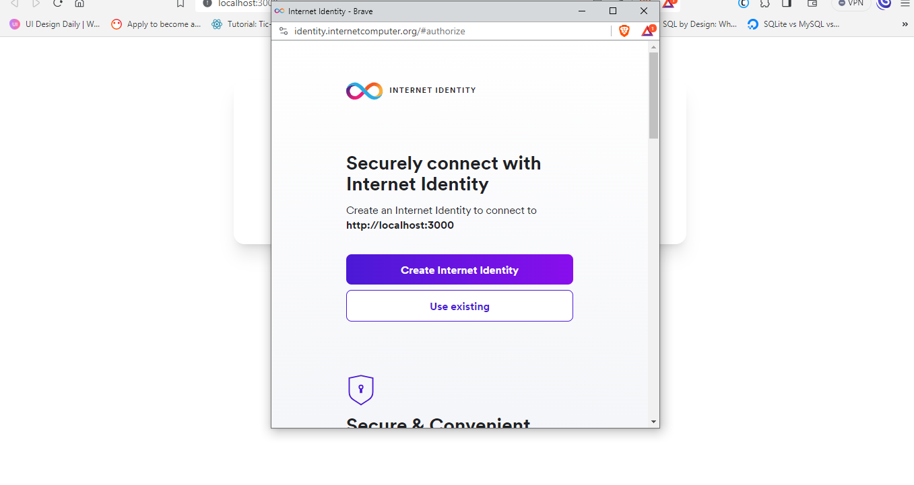
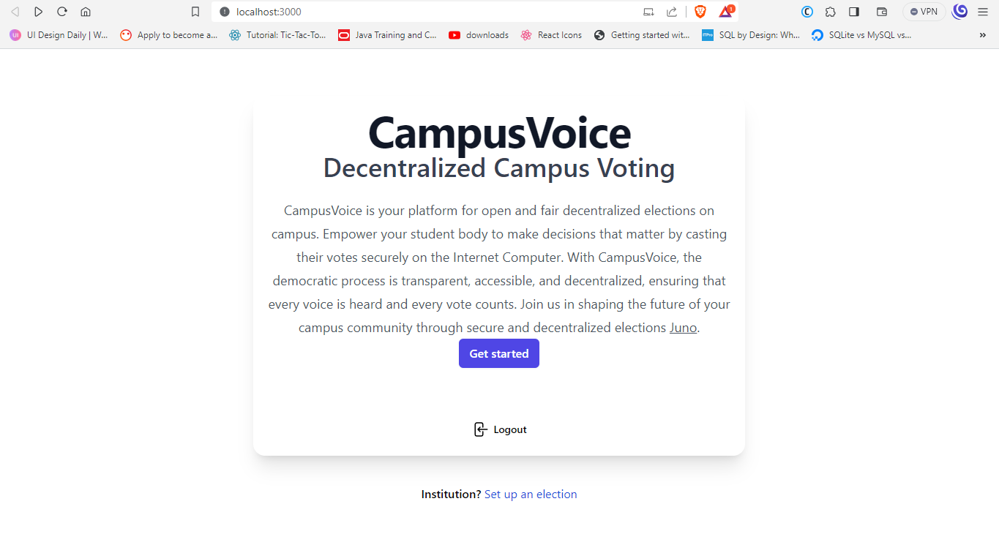
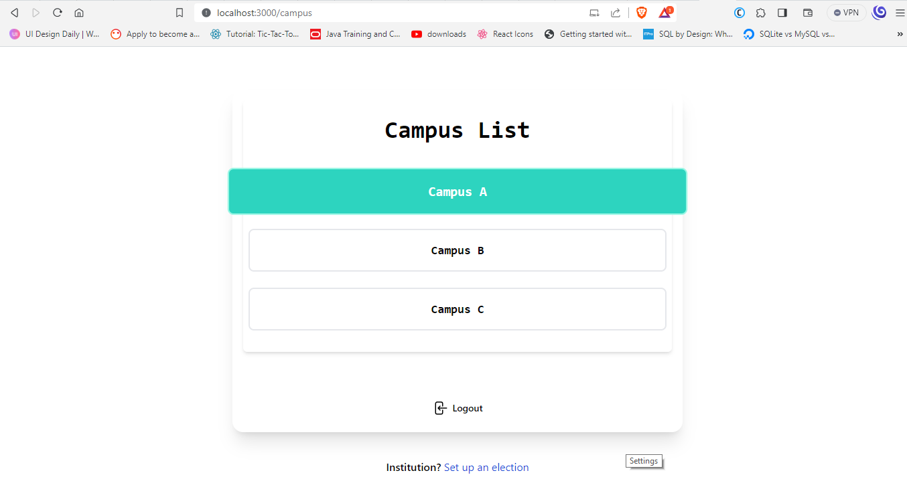
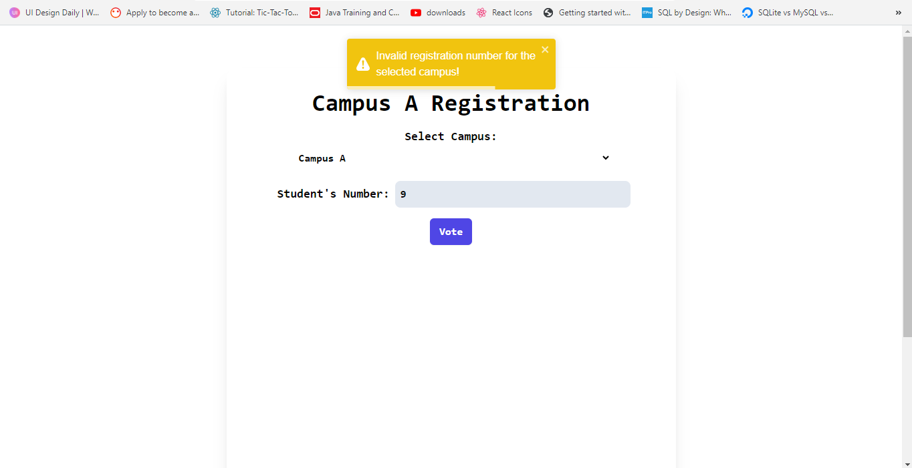
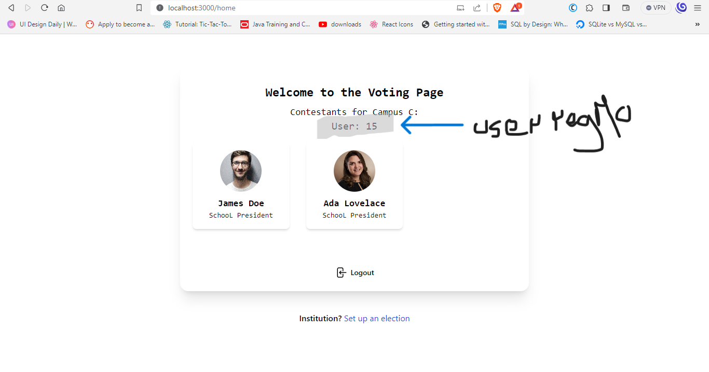
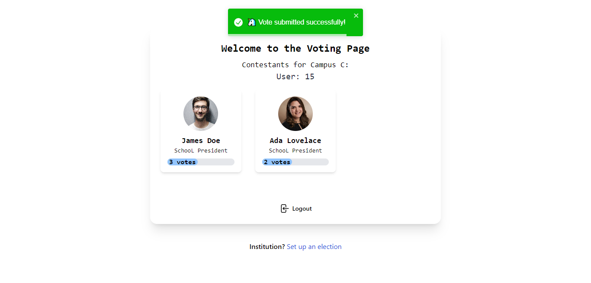

# 🏫 Campus Voting Website

Democracy is at the heart of every civilization, and for this reason it is one of the most targeted areas by criminal masterminds and power addicts of our modern wold. However, the recent rise of blockchain technology, more specifically the Internet Computer has given everyone the power to own and control their own data. Campus voice is a web3 application built on the Internet Computer using React, Tailwind CSS and the Juno toolkit. With Campus Voice the voting ledger is stored directly in the Internet's Computer blockchain making it immutable. This not only makes the application credible and reliable but also fast and cheap due to the Internet's Computer low gas fees.

## 📚 Table of Contents

1. [Introduction](#introduction)
2. [Getting Started](#getting-started)
   - [Prerequisites](#prerequisites)
   - [Installation](#installation)
3. [Usage](#usage)
4. [Features](#features)
5. [Technologies Used](#technologies-used)
6. [Deployment](#deployments)
7. [Contributing](#contributing)
8. [License](#license)
9. [Contact](#contact)

## 🚀 Introduction

The Campus Voting Website is designed to simplify the voting process for campus elections. It leverages modern web technologies such as React, Ant Design, Tailwind CSS, and Web3 through the Juno toolkit. This README will guide you through setting up and using the application.

## 🛠️ Getting Started

### Prerequisites

Before you begin, ensure you have the following installed:

- Node.js and npm
- Git
- Juno Toolkit [See Juno Docs](https://juno.build/docs/intro)
- Internet Identity [Get your identity](https://identity.internetcomputer.org/#)

### Installation

1. Clone the repository:

   ```bash
   git clone https://github.com/divin3circle/workshops.git
   ```

1. Navigate to project directory:

   ````bash
   cd workshops
   cd react
       ```
   ````

1. Install project dependencies:
   ```bash
   npm install
   #or
   yarn install
   ```
1. Start the development server:
   ```bash
   npm run dev
   #takes a few minutes to start for the first time
   ```
1. Access the website on your localhost:3000

## 🎮 Usage

1. Visit the website at http://localhost:3000.
1. Sign in or create an account. You should see a place to login with your internet identity.
   
   
1. Next click on get started to start using the application.
   
1. On the Campus page choose any campus from the list A, B or C. This list can be increased or reduced depending on the application.
   
1. Now enter your registration number. For simplicity and demonstration purposes, valid registration numbers for the campuses are as follows:
   - Campus A: 1,2,3,4,5,6
   - Campus B: 7,8,9,10,11,12
   - Campus C: 13,14,15,16,17,18
   - NB: Entering an invalid number displays the screen below:
     
1. Once logged in successfully you will be able to see the contestants for your chosen campus and your registration number as well as shown below:
   
1. To vote for contestant just click on his/her card. The UI will then update to show you the vote tally, and a successful pop-up message as well. For demonstration purposes the contestants have different starting points in votes tally to help you visualize the voting process. Some user reg numbers have also already voted thus can't vote again.
   
1. You can logout of the application by clicking the logout button below the page.

## 🌟 Features

- User authentication and account management on the Internet Computer.
- Secure and transparent voting process.
- Real-time election results.
- Responsive design for various devices.
- Real-time feedback from the blockchain

## 😎 Future Improvements

- OTP Authentication from the Campus admin systems
- A separate websites for campus admins to list their contestants
- Multiple voting positions per campus
- Migrating to include more than just campuses

## 🔧 Technologies Used

- React
- Tailwind CSS
- Web3 (via Juno Toolkit)
- Node.js
- Internet

## Deployments

## Fleek Deployment

🚀 Check out the live deployment of our Campus Voting Website on Fleek:

[](https://kpewl-saaaa-aaaad-qfvdq-cai.ic.fleek.co/)

This deployment is hosted on Fleek and is accessible for testing and usage. Feel free to explore the website and cast your votes in the campus elections.

**Deployment Link:** [https://kpewl-saaaa-aaaad-qfvdq-cai.ic.fleek.co/](https://kpewl-saaaa-aaaad-qfvdq-cai.ic.fleek.co/)

## Vercel Deployment

🚀 Our Campus Voting Website is also deployed on Vercel for your convenience:

[](https://campus-voice.vercel.app/)

You can access the website on Vercel and experience its features.

**Deployment Link:** [https://your-vercel-project.vercel.app/](https://your-vercel-project.vercel.app/)

## 🤝 Contributing

We welcome contributions from the community. To contribute, follow these steps:

1. Fork the repository.
2. Create a new branch for your feature or bug fix: `git checkout -b feature-name`.
3. Make your changes and commit them: `git commit -m "Add feature-name"`.
4. Push your changes to your fork: `git push origin feature-name`.
5. Create a pull request to the main repository.

Please make sure to followther [Code of Conduct](CODE_OF_CONDUCT.md) when contributing.

## 📧 Contact

If you have any questions or suggestions, feel free to contact us at [your@email.com](mailto:sylusabel1@gmail.com).
